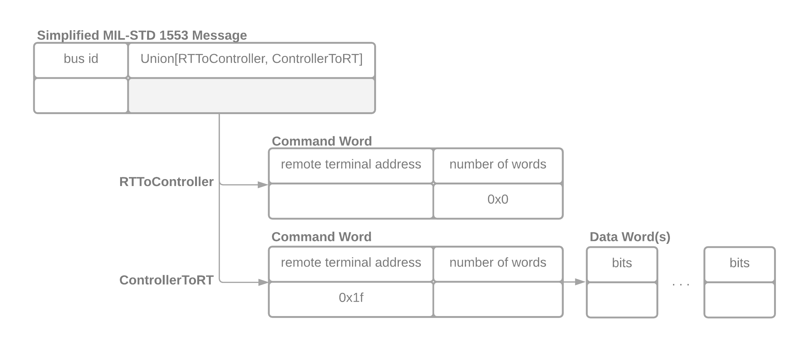

# Design Document

## Conditional Nested Data Structures

This is the design document for as I am calling it not "bitnest" for
"nested bits". The aim to explain the motivation for this package and
how it is a needed piece in efficiently parsing binary packets of
data. We hope to address why this is being built as well and how this
is going to be built.

## Background

### 1553 Motivating Example

This work was motivated for client work that we were doing on parsing
the chapter 10 specification. A detailed document on the specification
can be found on the [irig106
site](http://www.irig106.org/docs/106-15/chapter10.pdf) however still
leaves some ambiguity. Chapter 10 is a complex specification with many
nested parts see the [project
atac/libirig106](https://github.com/atac/libirig106) for a detailed
list of all the unique packet types. The key here is that these
protocols are well defined. In the image bellow we show a fake but
representative specification of a 1553 message (a type of chapter 10
packet) that also tries to detail some of the challenges.



You will see that a 1553 message is composed of a header that consists
of a `bus id` that is an unsigned integer of 8 bits followed by either
an `RTToController` or `ControllerToRT` frame. In order to determine
which one it is we have to check the `remote terminal address` (5 bit
unsigned integer) which both have. If the `remote terminal address` is
`0x1f` or 31 it is a `ControllerToRT` message otherwise it is an
`RTToController` message. Additionally if it is an `RTToController`
frame the `number of words` must be equal to zero. If it is a
`ControllerToRT` message then the frame is followed by `N` 16 bit
`DataWords` where `N` is equal to the `number of words`. To summarize
there are two packets "datatypes" that are described by this
specification.


The first datatype is `1553 Message[bus id,
RTToController[CommandWord[remote terminal address, number of
words]]]` that maps out to a record of `bus id`, `remote terminal
address`, and `number of words`. Notice how this datatype has a well
defined static length `8 bits + 5 bits + 3 bits` and has three
conditions associated with it `remote_terminal_address != 31`, `number
of words == 0`, and the length of the packet must be 16 bits.

The second datatype is a bit more complex `1553 Message[bus id,
RTToController[CommandWord[remote terminal address, number of words],
*DataWord[bits]]]`. Where `*` indicates zero or more of the given
datatype (a vector) and `*` is equal to the `number of words`
field. Similar to datatype 1 the length is well defined though symbol
`8 bits + 5 bits + 3 bits + (16 bits) * number of words`. We also have
two associated conditions: `remote terminal address` must equal 31 and
the length of the packet must match the symbolic formula above.

### Data Type Complications

While not shown in this example above additional complications show up
in the fields seen within the chapter 10 data words section. First off
we realize the fact that we are dealing with non byte-aligned fields
of non standard lengths. 

Non byte aligned makes it much more difficult to access the value of a
given fields due to complex masking and shifting operations. 

Non standard lengths pose a more complex problem however. Lets
consider the case of a 6 bit [two's compliment signed
integer](https://en.wikipedia.org/wiki/Two%27s_complement). Ignoring
edianess. In this standard the left most bit designates the sign of
the integer: 1 negative and 0 positive. This alone brings the problem
of translating this into a standard size that can be operated on take
for example `100111`. If we would like to operate on this as an 1 byte
signed integer we need to move the left `1` left two places to
`1XX00111`. But what to do with the `X`'s? Well in the two's
compliment representation we will pad with `0` if it is positive and
`1` if it is negative with our final result being `11100111`. This
problem becomes even more complicated when you consider the [IEE-753
floating point
specification](https://en.wikipedia.org/wiki/IEEE_754). How do you
handle different size exponent and decimal bits.

At the end of the day once a given packet has been parsed these data
types must be accessible via byte aligned fields to allow for
efficient computation. However this step should be deferred as long as
possible since "realizing/creating" these values requires moving
data. This step should not be required for matching a given packet
with a specific data type.

### Similar Problems and Approaches

Our use case is not unique. There are many binary protocols that are
well defined similar to the chapter 10 specification. Many I would say
are simpler protocols.
  - Ethernet, IP, TCP/UDP, HTTP (of course with many more branches for
    each layer) is the dominant use case
  - [pyatv](https://github.com/postlund/pyatv) decodes a well defined binary protocol for audio and video
  - etherium protocol [brownie](https://github.com/eth-brownie/brownie), [raiden](https://github.com/raiden-network/raiden)
  - [scancode](https://github.com/nexB/scancode-toolkit) scans binary
    files to determine the given file type and information about the file
  - [nmigen](https://github.com/m-labs/nmigen) interacting with emulated hardware devices
  
Complex well defined binary protocols are everywhere where information
has to travel over the wire where bandwidth is at a premium. There are
toolkits designed for working with some of these problems primarily
in the networking space. We would like to highlight some of them:

#### Scapy

[Scapy](https://scapy.readthedocs.io/en/latest/index.html) is a python toolkit to crafting up and reading network
packets. In addition these have a built in [high level language for
describing new
frames](https://scapy.readthedocs.io/en/latest/build_dissect.html#simple-example). I'd
argue this is a high level description of a frame within a packet.

```python
class Disney(Packet):
    name = "DisneyPacket "

    fields_desc=[ 
        ShortField("mickey",5),
        XByteField("minnie",3) ,
        IntEnumField("donald", 1, { 1: "happy", 2: "cool" , 3: "angry" })
    ]
```

Lets say the `Disney` packet is at the application layer in the
network stack. To me the missing piece here is given a full ethernet
packet how do I efficiently parse it and return whether it is a Disney
packet or HTTP packet? ScaPy doesn't seem to have an efficient backend
for parsing these custom packet types and does not have the logic to
inspect the packet to determine if it is an HTTP packet (e.g. the
first 4 bytes are `HTTP`) or if it is a Disney packet. The hope is
that our proposed solution could be a backend for `Scapy` to
efficiently parse network packets. Additionally currently scapy
translates this problem into a python `struct` within the stdlib. For
example the following would translate to.

```python
import struct

packet = ...
struct.unpack('h3BB', packet)
```

However here see that we are conflating identifying the packet type
and parsing the packet type. Also here they are working with bytes and
not bits.

#### P4 Programming Language

Taken from wikipedia "P4 is a programming language for controlling
packet forwarding planes in networking devices, such as routers and
switches". It is a domain specific language for describing network
packets. This tool is specialized for the efficient parsing of network
packets and based on a filtering specification certain packets are
rejected and accepted. See here for a [list of examples of the
language](https://github.com/p4lang/tutorials/tree/master/exercises). Below
is a partial code example. Looking at the
[specification](https://github.com/p4lang/p4-spec/blob/4256308d5f9f87a9346bb3fbdbe6c9da661ce5d4/p4-16/spec/P4-16-spec.mdk#L1802)
we can already see limitations on the data types that you can work
with (e.g. no floating point support and non-signed two compliment
integers). However it does support non-byte aligned bits. It would
definitely be worth investigating how P4 works.

```c
header ethernet_t {
    macAddr_t dstAddr;
    macAddr_t srcAddr;
    bit<16>   etherType;
}

header ipv4_t {
    bit<4>    version;
    bit<4>    ihl;
    bit<8>    diffserv;
    bit<16>   totalLen;
    bit<16>   identification;
    bit<3>    flags;
    bit<13>   fragOffset;
    bit<8>    ttl;
    bit<8>    protocol;
    bit<16>   hdrChecksum;
    ip4Addr_t srcAddr;
    ip4Addr_t dstAddr;
}

struct metadata {
    /* empty */
}

struct headers {
    ethernet_t   ethernet;
    ipv4_t       ipv4;
}

...
```

### Traditional Approach

The P4 language and Scapy show a "high level" of representing binary
protocols without necessarily specifying "how" to parse the
packets. This however is not the typical approach. In the case of
ethernet packets the dominant library is
[libpcap](https://github.com/the-tcpdump-group/libpcap) and related
wrappers around this tool. These are hand written parsers for the
given protocols they are given to parse. Take the 1553 problem stated
above. Here I'd like to show pseudo code of a solution to demonstrate
the typical approach.

```python
class CommandWord:
    length = 8

    def __init__(self, packet):
        self.packet = packet

    def is_rttocontroller_frame(self):
        return self.packet[0:5] != 0x1f and self.packet[5:8] == 0x0

    def is_controllertort_frame(command_word)
        return command_word[0:5] == 0x1f

    @property
    def number_of_words(self):
        return int(command_word[5:8])


class DataWord:
    length = 16


def parse(packet):
    header_length = 8 + CommandWord.length

    # can't parse command words unless correct length
    if len(packet) < header_length:
        return "packet not known"

    command_word = CommandWord(packet[8:16])

    if command_word.is_rttocontroller_frame():
        if len(packet) == header_length:
            return "datatype 1"
    elif command_word.is_controllertort_frame():
        if len(packet) == (header_length + DataWord.length * command_word.length_of_words):
            return "datatype 2"
```

There certainly may be ways to simplify this code and write it better
but one thing remains. The code has been expressed in this way so that
it is easier to reason about. But what happends when you add an
additional field to say the header. You now need to update the parser
on header lengths etc. and there may be other new complex checks that
you need to make. I believe that this is hard work that a compute
could also generate from a high level specification of the data
structures. The "checks" can be encoded as conditions that much be
matched.

So to highlight some issues:
  - writing this code efficiently requires low level programming language knowledge
  - adding new fields can be tedious and non-intuitive how they change the parser
  - the parser is not self documenting. there is no way to self
    document the grammar that this parser handles
  - we not have one more parser for a specific binary protocol
  - testing requires example data from the protocol which for some
    applications where the packets are classified is difficult for
    collaboration with open source

## Implementation

I would argue that is starting to look like a well defined grammar of
sorts. In [Chomsky's
Hierarchy](https://en.wikipedia.org/wiki/Chomsky_hierarchy) this feels
almost like a regular expression. To me this is partially validated
when I look at the [P4
specification](https://github.com/p4lang/p4-spec/issues/217). In this
issue and several other issues they describe P4 as a finite state
machine and not turning complete. I'd even say this is a grammar that
the code paths can be accounted for to create a highly optimized
parser to parse the packets. We are proposing a high level declarative
representation of the binary protocol. For example a representation of
the 1553 Message shown above.

```python
from bitnest.field import Struct, UnsignedInteger, Bits, Union, FieldRef, Vector


class CommandWord(Struct):
    fields = [
        UnsignedInteger("remote_terminal_address", 5),
        UnsignedInteger("number_of_words", 3),
    ]


class DataWord(Struct):
    fields = [
        Bits("data", 16),
    ]


class RTToController(Struct):
    name = "Remote Terminal to Controller"

    fields = [
        CommandWord,
        Vector(DataWord, length=FieldRef("CommandWord.number_of_words")),
    ]

    conditions = [
        (FieldRef("CommandWord.remote_terminal_address") == 0x1F)
    ]


class ControllerToRT(Struct):
    name = "Controller to Remote Terminal"

    fields = [
        CommandWord,
    ]

    conditions = [
        (FieldRef("CommandWord.number_of_words") == 0x0)
    ]


class MILSTD_1553_Message(Struct):
    """This is a mock specification for a MILSTD 1553 Message to be as
    simple as possible while still representative of the difficulty of
    handling specifications.

    """

    name = "MIL-STD 1553 Mock Message"

    fields = [
        UnsignedInteger("bus_id", 8),
        Union([
            RTToController,
            ControllerToRT,
        ]),
    ]
```

Here we describe a set of data structures which reference each other
and data types within the `fields` attribute. Additionally there are a
set of `conditions` that must be met in order for the given structure
to be a valid path in determining the packet type. Said in another way
if the conditions are not met for a given class e.g. `ControllerToRT`
we know that the packet does not contain the path through the
`ControllerToRT` and it is either an unknown packet datatype or a
`ControllerToRT` packet. Using this high level description of the
structures we can self document the protocol. This is also where the
name for this work came from since it is a nested set of structures
that satisfy given conditions. Bitnest already supports generating a
graph visualization of the specification and markdown document of the
specification shown below.

```markdown
# MILSTD_1553_Message

This is a mock specification for a MILSTD 1553 Message to be as
simple as possible while still representative of the difficulty of
handling specifications.

## Structure

| name   | data type                                                                   | number of bits | description |
|--------|-----------------------------------------------------------------------------|----------------|-------------|
| bus_id | UnsignedInteger                                                             | 8              |             |
|        | Union[[RTToController](#RTToController), [ControllerToRT](#ControllerToRT)] |                |             |

# RTToController
## Structure

| name | data type                   | number of bits | description           |
|------|-----------------------------|----------------|-----------------------|
|      | [CommandWord](#CommandWord) |                |                       |
|      | Vector                      |                | [DataWord](#DataWord) |

## Conditions

- 'CommandWord.remote_terminal_address' == 31

# CommandWord
## Structure

| name                    | data type       | number of bits | description |
|-------------------------|-----------------|----------------|-------------|
| remote_terminal_address | UnsignedInteger | 5              |             |
| number_of_words         | UnsignedInteger | 3              |             |

# DataWord
## Structure

| name | data type | number of bits | description |
|------|-----------|----------------|-------------|
| data | Bits      | 16             |             |

# ControllerToRT
## Structure

| name | data type                   | number of bits | description |
|------|-----------------------------|----------------|-------------|
|      | [CommandWord](#CommandWord) |                |             |

## Conditions

- 'CommandWord.number_of_words' == 0

# CommandWord

## Structure

| name                    | data type       | number of bits | description |
|-------------------------|-----------------|----------------|-------------|
| remote_terminal_address | UnsignedInteger | 5              |             |
| number_of_words         | UnsignedInteger | 3              |             |
```


While it is nice to be able to create documentation and visualize the
specification ultimately it comes down to parsing
performance. `bitnest` will act as a compiler of this high level
domain specific python representation of nested conditional data
structures and generate a parser. 

In general the parser implementation should not matter. All that
matters is that a performant program is produced. The easiest target
that we see at this moment is numba which will JIT (just in time)
produce an llvm compiled code to parse a given packet.

The pseudo code could go as follows. Since this is pseudo code of
course the actual indexing and comparison of bits will be done via bit
masks etc. but I'll leave that as an implementation
detail. Additionally since we know the packets that we are parsing we
can optimize these condition evaluations as to minimize the number of
evaluations and provide the shortest path for the most common
packets. Similar to [PGO in
gcc](https://en.wikipedia.org/wiki/Profile-guided_optimization) though
in our case we would analyze the data to inform our compiler on the
optimal code paths.

```python
def parser(packet):
    if len(packet) == 16 and packet[8:11] != 0x1f and packet[11:16] == 0:
         return "datatype 1"
    elif len(packet) >= 16 and len(16 + packet[11:16] * 16) == len(packet) and packet[8:11] == 0x1f:
         return "datatype 2"
    else:
         return "I have not clue what packet type this is!"
```

Would a human ever write this code? No! It is not maintainable and
would be extremely prone to bugs. We are proposing a way to describe a
given binary protocol at a high level and then implement a compiler to
produce a parser of binary packets. Much like a regular expression is
compiled into a parser for arbitrary strings of bytes.

